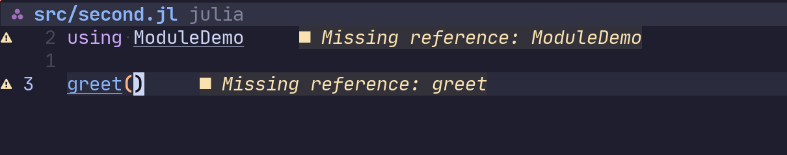

# Demo of issues with Julias LSP


## Setup

Run
```julia
]
instantiate
```

A module with one exported function can be found in `src/ModuleDemo.jl`

A second script exists in `src/second.jl` with imports the `ModuleDemo` and executes the function.

This works fine, however the LSP is unable to find the ModuleDemo


